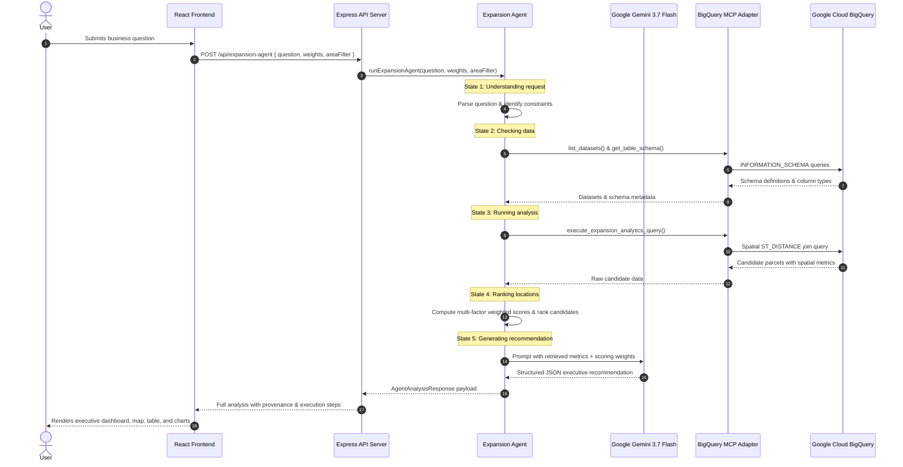
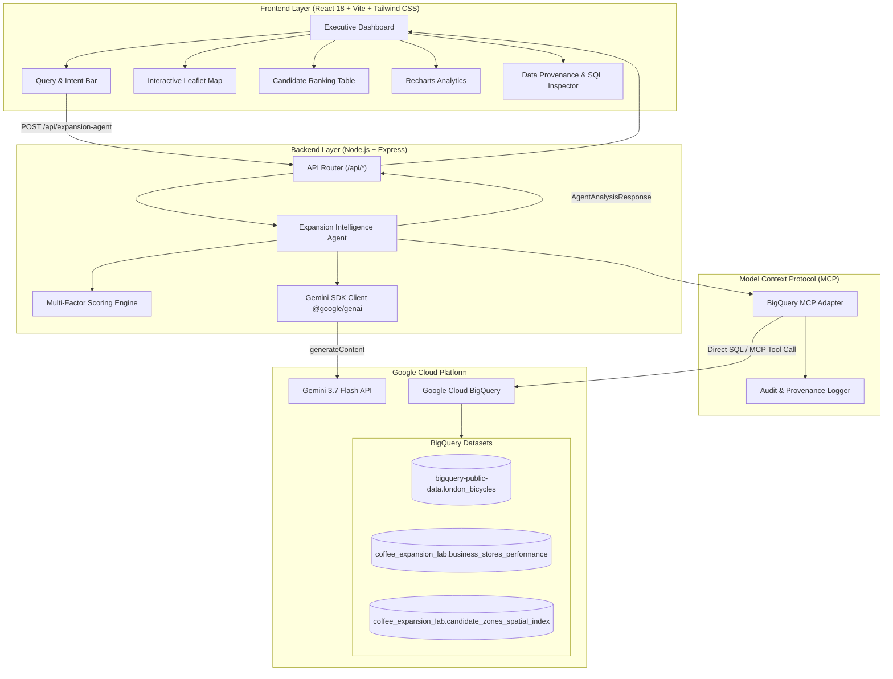

# Coffee Shop Expansion Intelligence

> AI-powered location strategy using Gemini, BigQuery and BigQuery MCP Server.

[](https://www.typescriptlang.org/)
[](https://react.dev/)
[](https://nodejs.org/)
[](https://ai.google.dev/)
[](https://cloud.google.com/bigquery)
[](https://cloud.google.com/run)
[](https://tailwindcss.com/)

---

## Table of Contents

- [Overview](#overview)
- [Problem Statement](#problem-statement)
- [Solution](#solution)
- [Key Features](#key-features)
  - [AI Expansion Agent](#ai-expansion-agent)
  - [Natural Language Queries](#natural-language-queries)
  - [BigQuery Analytics & Spatial SQL](#bigquery-analytics--spatial-sql)
  - [Model Context Protocol (MCP) Data Access](#model-context-protocol-mcp-data-access)
  - [Multidimensional Location Scoring](#multidimensional-location-scoring)
  - [Candidate Ranking & Side-by-Side Comparison](#candidate-ranking--side-by-side-comparison)
  - [Interactive Geospatial Map](#interactive-geospatial-map)
  - [Visual Analytics & Charts](#visual-analytics--charts)
  - [Evidence-Based Recommendations](#evidence-based-recommendations)
  - [Data Provenance & Query Transparency](#data-provenance--query-transparency)
  - [Demo Dataset Mode & Live BigQuery Mode](#demo-dataset-mode--live-bigquery-mode)
- [How It Works](#how-it-works)
- [System Architecture](#system-architecture)
- [BigQuery Schema & Datasets](#bigquery-schema--datasets)
- [Scoring Methodology](#scoring-methodology)
- [API Endpoints](#api-endpoints)
- [Getting Started](#getting-started)
  - [Prerequisites](#prerequisites)
  - [Environment Variables](#environment-variables)
  - [Installation & Local Run](#installation--local-run)
  - [Production Build](#production-build)
- [Deploying to Google Cloud Run](#deploying-to-google-cloud-run)
- [Limitations](#limitations)
- [Future Improvements](#future-improvements)

---

## Overview

**Coffee Shop Expansion Intelligence** is an enterprise decision-intelligence platform engineered to answer the high-stakes commercial question:

> **"Where should we open our next coffee shop?"**

Rather than behaving like a generic chatbot that produces ungrounded text, the system functions as an **analytical reasoning agent**. It parses natural language business questions, discovers relevant Google Cloud BigQuery datasets via the Model Context Protocol (MCP) tool adapter, validates column schemas, generates spatial SQL joins (`ST_DISTANCE`), calculates empirical mobility and revenue metrics, evaluates candidate parcels against a four-factor scoring model, and presents an evidence-backed strategic recommendation complete with full data provenance.

---

## Problem Statement

Selecting a viable retail site for a coffee chain requires evaluating multiple overlapping spatial and commercial constraints:

1. **Active Mobility & Cycling Traffic**: High-frequency commuter corridors (e.g. protected cycle superhighways) drive repeat morning rush-hour footfall.
2. **Pedestrian Demand Density**: Total foot-traffic volume during key trading windows directly impacts daily transaction counts.
3. **Cannibalization & Store Proximity**: Opening too close to an existing company branch divides existing customer traffic without expanding market share.
4. **Commercial Lease Realities**: High-revenue sites often carry higher rent indices that compress operating margins.

Traditional site selection relies on disconnected spreadsheets, manual GIS tools, or subjective intuition. This application automates the end-to-end data pipeline to provide rapid, defensible, data-grounded recommendations.

---

## Solution

The system combines Google's reasoning model (**Gemini 3.7 Flash**), **Google Cloud BigQuery**, and the **BigQuery MCP Tool Adapter** into an integrated spatial analytics application:

```
User Query
  └──> Web Application (React + Tailwind CSS)
        └──> Backend API (/api/expansion-agent)
              └──> Gemini Reasoning Agent
                    └──> BigQuery MCP Tool Adapter
                          └──> BigQuery Spatial Analytics (ST_DISTANCE Joins)
                                └──> Data Validation & Multi-Factor Scoring Engine
                                      └──> Candidate Ranking & Evidence Synthesis
                                            └──> Interactive Executive Dashboard
```

---

## Key Features

### AI Expansion Agent
- Uses `gemini-3.7-flash` (with automated fallback to `gemini-flash-latest` and `gemini-3.1-flash-lite`, and deterministic fallback if no API key is set).
- Interprets user intent, extracts geographical constraints (e.g. *Blackfriars*, *Hackney*, *Islington*), adjusts factor weightings, and synthesizes executive briefs grounded in retrieved data.

### Natural Language Queries
- Accepts freeform strategic questions such as:
  - *"Where should we open our next coffee shop to maximize cyclist commuter traffic?"*
  - *"Find candidate locations near protected cycle routes with zero store cannibalization"*
  - *"Compare Blackfriars North against London Fields and Angel Islington"*

### BigQuery Analytics & Spatial SQL
- Formulates and executes BigQuery spatial queries using `ST_DISTANCE`, `ST_GEOGPOINT`, and geographic buffer functions to measure proximity between candidate parcels, cycle corridors, and existing store coordinates.

### Model Context Protocol (MCP) Data Access
- Standardized MCP tool suite:
  - `list_datasets`: Discovers accessible analytical datasets.
  - `get_table_schema`: Inspects column definitions, data types, and primary keys.
  - `execute_expansion_analytics_query`: Runs spatial distance joins and returns structured candidate datasets.
  - `get_existing_stores` / `get_public_bike_routes`: Fetches operational branch coordinates and cycle route shapefiles.

### Multidimensional Location Scoring
- Normalized 0–100 composite index calculated across 4 weighted strategic dimensions:
  1. **Cycling Accessibility (35%)**: Proximity to segregated cycleways, daily cyclist volume, and cycle lane density.
  2. **Customer Demand (25%)**: Hourly pedestrian foot traffic and estimated monthly order volume.
  3. **Store Saturation / Isolation (20%)**: Distance to nearest existing branch (protection against revenue cannibalization).
  4. **Revenue Potential (20%)**: Projected gross monthly turnover balanced against the commercial rent index.
- Interactive weight sliders allow real-time recalculation of candidate scores directly in the UI.

### Candidate Ranking & Side-by-Side Comparison
- Sortable tabular view of all evaluated parcels with status badges (`Recommended`, `Strong Candidate`, `Moderate`, `Low Priority`).
- Dedicated multi-candidate comparison modal highlighting key metric differentials.

### Interactive Geospatial Map
- Leaflet map with custom marker layers for:
  - Candidate parcels (color-coded by viability tier).
  - Existing store locations (with 1 km non-cannibalization buffer rings).
  - Public cycle routes (color-coded by corridor type: Superhighways, Quietways, Protected Lanes).
- Interactive popup cards displaying instant location metrics.

### Visual Analytics & Charts
- Recharts-powered factor breakdown charts comparing candidates across individual score components.
- **Cycling Accessibility vs. Projected Monthly Revenue** quadrant scatter matrix.

### Evidence-Based Recommendations
- Top recommendation card answering the 5 core executive questions:
  1. *Where should we open?*
  2. *Which location is recommended?*
  3. *Why?*
  4. *What data supports it?*
  5. *How was the score calculated?*

### Data Provenance & Query Transparency
- Audit modal disclosing executed SQL queries, execution runtimes, rows returned, dataset schemas inspected, and timestamped MCP tool logs.

### Demo Dataset Mode & Live BigQuery Mode
- **Live Mode**: Connects to a Google Cloud BigQuery project and MCP server via official Node.js `@google-cloud/bigquery` client or MCP HTTP endpoint.
- **Sandbox Demo Mode**: Ships with pre-loaded London geospatial and retail benchmark data for immediate evaluation without requiring cloud credentials.

---

## How It Works



---

## System Architecture



---

## BigQuery Schema & Datasets

The application utilizes three core datasets:

| Dataset | Table | Description | Key Columns |
| :--- | :--- | :--- | :--- |
| `bigquery-public-data.london_bicycles` | `cycle_routes_and_spatial_network` | Public cycling corridors and volume telemetry | `route_id`, `route_name`, `route_type`, `route_length_km`, `surface_type`, `daily_cyclist_volume`, `route_geometry` (GEOGRAPHY) |
| `coffee_expansion_lab` | `business_stores_performance` | Historical company store performance and coordinates | `store_id`, `store_name`, `city`, `area`, `latitude`, `longitude`, `monthly_sales`, `daily_customers`, `store_age_months`, `rating` |
| `coffee_expansion_lab` | `candidate_zones_spatial_index` | Commercial registry of candidate locations | `candidate_id`, `parcel_name`, `area`, `latitude`, `longitude`, `avg_foot_traffic_per_hour`, `commercial_rent_index` |

### Example Spatial Join SQL
```sql
SELECT 
  c.candidate_id,
  c.parcel_name,
  c.area,
  c.latitude,
  c.longitude,
  c.avg_foot_traffic_per_hour,
  c.commercial_rent_index,
  MIN(ST_DISTANCE(ST_GEOGPOINT(c.longitude, c.latitude), r.route_geometry)) AS nearest_bike_route_dist_meters,
  r.route_name AS nearest_bike_route_name,
  r.daily_cyclist_volume AS daily_cyclist_volume_estimate,
  MIN(ST_DISTANCE(ST_GEOGPOINT(c.longitude, c.latitude), ST_GEOGPOINT(s.longitude, s.latitude))) / 1000.0 AS nearest_store_dist_km,
  COUNTIF(ST_DISTANCE(ST_GEOGPOINT(c.longitude, c.latitude), ST_GEOGPOINT(s.longitude, s.latitude)) <= 1000) AS stores_within_1km
FROM `coffee_expansion_lab.candidate_zones_spatial_index` c
CROSS JOIN `bigquery-public-data.london_bicycles.cycle_routes_and_spatial_network` r
CROSS JOIN `coffee_expansion_lab.business_stores_performance` s
GROUP BY 1,2,3,4,5,6,7, r.route_name, r.daily_cyclist_volume;
```

---

## Scoring Methodology

Each candidate location receives a normalized 0–100 score across four dimensions:

$$\text{Composite Score} = (w_{\text{cycling}} \times S_{\text{cycling}}) + (w_{\text{demand}} \times S_{\text{demand}}) + (w_{\text{saturation}} \times S_{\text{saturation}}) + (w_{\text{revenue}} \times S_{\text{revenue}})$$

- **Default Weights**:
  - $w_{\text{cycling}} = 0.35$
  - $w_{\text{demand}} = 0.25$
  - $w_{\text{saturation}} = 0.20$
  - $w_{\text{revenue}} = 0.20$
- **Weight Normalization**: User-adjusted weights are automatically normalized so $\sum w_i = 1.0$.
- **Recommendation Tiers**:
  - $\ge 85$: `Recommended`
  - $75 - 84$: `Strong Candidate`
  - $60 - 74$: `Moderate`
  - $< 60$: `Low Priority`

---

## API Endpoints

| Method | Endpoint | Description |
| :--- | :--- | :--- |
| `GET` | `/api/health` | Service health and uptime check |
| `GET` | `/api/mcp-status` | Current BigQuery MCP connection status and table availability |
| `POST` | `/api/expansion-agent` | Executes the end-to-end spatial analysis agent pipeline |
| `POST` | `/api/mcp/configure` | Updates BigQuery project ID, dataset, or MCP endpoint settings |
| `GET` | `/api/candidates` | Returns raw candidate location records |
| `GET` | `/api/existing-stores` | Returns company store locations and monthly performance |
| `GET` | `/api/bike-routes` | Returns cycle superhighway geometry segments |

---

## Getting Started

### Prerequisites
- **Node.js** v18.0.0 or higher
- **npm** v9.0.0 or higher
- *(Optional for live GCP mode)* Google Cloud Project with BigQuery API enabled, and a Gemini API Key.

### Environment Variables
Copy `.env.example` to `.env`:

```bash
# Gemini API Key (Server-side reasoning)
GEMINI_API_KEY=your_gemini_api_key_here

# Google Cloud & BigQuery Configuration
BIGQUERY_PROJECT_ID=your_gcp_project_id
BIGQUERY_DATASET=coffee_expansion_lab

# BigQuery MCP Server Endpoint (Optional - defaults to Sandbox Demo if empty)
BIGQUERY_MCP_SERVER_URL=https://your-bigquery-mcp-server.a.run.app

# Optional Table Overrides
BIGQUERY_STORES_TABLE=business_stores_performance
BIGQUERY_BIKE_ROUTES_TABLE=cycle_routes_and_spatial_network
BIGQUERY_CANDIDATE_ZONES_TABLE=candidate_zones_spatial_index
```

### Installation & Local Run

```bash
# 1. Install dependencies
npm install

# 2. Start development server (Node/Express backend + Vite frontend on port 3000)
npm run dev
```

Open `http://localhost:3000` in your browser.

### Production Build

```bash
# Compile client and bundle server
npm run build

# Launch production server
npm start
```

---

## Deploying to Google Cloud Run

The application is bundled into a self-contained container listening on port 3000.

```bash
# 1. Submit build to Google Artifact Registry / Container Registry
gcloud builds submit --tag gcr.io/$BIGQUERY_PROJECT_ID/coffee-expansion-intelligence

# 2. Deploy container to Cloud Run
gcloud run deploy coffee-expansion-intelligence \
  --image gcr.io/$BIGQUERY_PROJECT_ID/coffee-expansion-intelligence \
  --platform managed \
  --region asia-southeast1 \
  --allow-unauthenticated \
  --port 3000 \
  --set-env-vars GEMINI_API_KEY=$GEMINI_API_KEY,BIGQUERY_PROJECT_ID=$BIGQUERY_PROJECT_ID
```

---

## Limitations

1. **Cycling Sensor Telemetry**: Public bicycle sensor counts reflect typical weekday commuter flow patterns and may vary across seasonal weather events.
2. **Commercial Rent Indices**: Rent metrics are derived from quarterly zone averages and do not account for individual property lease negotiations.
3. **Sandbox vs Live BigQuery**: In demo mode, data is served from benchmark datasets matching real London geospatial shapefiles. Live BigQuery mode requires active Google Cloud credentials and service account permissions.

---

## Future Improvements

- **Weather-Adjusted Demand Forecasting**: Integrate historical rainfall telemetry to model rainy-day commuter shifts.
- **Competitor Brand Ingestion**: Ingest third-party specialty coffee shop locations alongside existing company stores for deeper saturation modeling.
- **Drive-Thru & Transit Hub Expansion**: Extend spatial scoring to suburban commuter train stations and bus interchanges.
- **Live Pub/Sub Ingestion**: Stream real-time foot-traffic sensor data via Google Cloud Pub/Sub.
