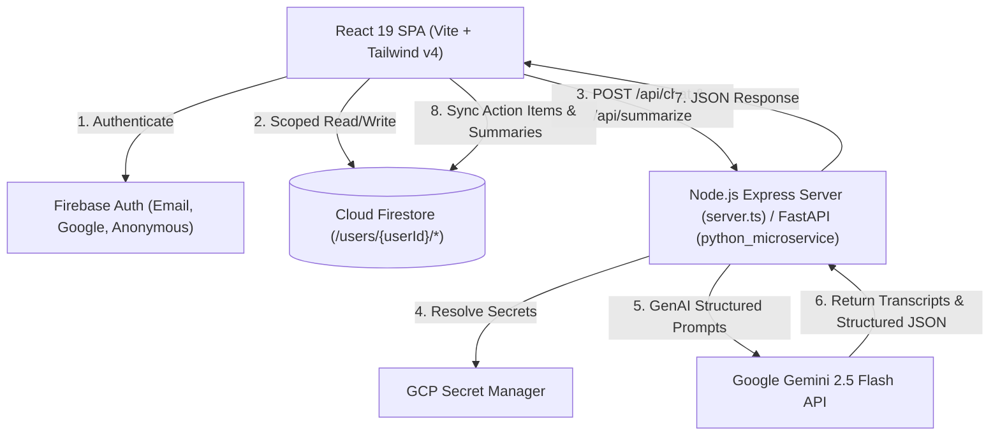

# 📔 Personal Gemini Journal

<div align="center">


### **Enterprise-Grade, Zero-Trust Secure Personal AI Journaling & Brainstorming Companion**

*Powered by Google Gemini 2.5 Flash, Cloud Firestore Tenant Isolation, and Firebase Authentication.*

[](LICENSE)
[](https://react.dev/)
[](https://ai.google.dev/)
[](https://www.typescriptlang.org/)
[](https://vitejs.dev/)
[](https://firebase.google.com/)
[](https://fastapi.tiangolo.com/)

</div>

---

## 🌟 Overview

**Personal Gemini Journal** is a privacy-first, enterprise-grade AI reflection companion and executive life coach. Built with **React 19**, **Express Node.js / Python FastAPI**, **Cloud Firestore**, and **Google Gemini 2.5 Flash**, it transforms raw personal scratchpad thoughts and multi-turn conversations into actionable goals, structured task boards, and comprehensive weekly cognitive insights.

Designed around a **Zero-Trust Security Architecture**, your journal entries, AI transcripts, and extracted action items are isolated at the database level using strict Cloud Firestore security rules (`/users/{userId}/*`). All Gemini AI processing occurs strictly server-side, ensuring zero API key exposure to browser clients.

---

## 🔥 Key Features

### 🤖 1. Multi-Turn AI Reflective Companion
Engage in rich, multi-turn reflective dialogue guided by 5 specialized journaling modes:
- 💡 **Socratic Mode**: Asks probing, curious questions that challenge shallow reasoning and deepen emotional self-awareness.
- 🚀 **Brainstorm Mode**: Provides creative frameworks, mind-mapping suggestions, and lateral thinking angles.
- 🧘 **Mindful Mode**: Offers a calm, grounded, non-judgmental presence focusing on gratitude, emotional regulation, and self-compassion.
- 🎯 **Action / Coaching Mode**: Acts as an executive coach focusing on clear deliverables, habit formation, and eliminating blockers.
- 🧩 **Problem Solver Mode**: Helps break down complex dilemmas into decision trees, trade-offs, and risk mitigations.

### ⚡ 2. Automated Action Item Extraction
- Uses Gemini 2.5 structured JSON schema enforcement (`responseSchema`) to parse journal entries and dialogue transcripts automatically.
- Extracts task titles, descriptions, priorities (`High`, `Medium`, `Low`), categories (`Work`, `Personal`, `Health`, `Finance`, `Learning`, `Creative`, `Relationships`), suggested deadlines, and tags.
- Direct synchronization with your isolated Cloud Firestore Task Board.

### 📊 3. Weekly Reflection & Cognitive Insight Dashboard
- Periodically analyzes accumulated journal entries to synthesize overarching thought patterns.
- Identifies recurring topics, goal status trajectories (`In Progress`, `Achieved`, `Emerging`), lingering unresolved dilemmas with suggested resolutions, and custom tailored reflection prompts for the upcoming week.

### 🔒 4. Enterprise Zero-Trust & Data Isolation
- **Cloud Firestore User Isolation**: Tenant subcollections (`/users/{userId}/journals`, `/users/{userId}/action_items`, `/users/{userId}/insights`) enforced strictly via [`firestore.rules`](file:///d:/Projects/GoogleAPAC/Cohort%203/Ideathon/personal-gemini-journal/firestore.rules).
- **Zero Client Secret Exposure**: All Gemini GenAI API calls execute strictly on Node.js/Python backends.
- **Dynamic Secret Manager Resolution**: Secret keys resolved at runtime from Google Cloud Secret Manager or environment variables.
- **Rate Limiting & DoS Protection**: Sliding window rate limiting (60 req/min) active on API endpoints.
- **Security Headers**: Production-ready CSP, HSTS, X-Content-Type-Options, and X-Frame-Options headers.

### 📈 5. Interactive Analytics & Security Inspector
- Visual mood distribution charts and category completion metrics.
- Built-in Security Architecture Audit modal demonstrating live compliance checks.

---

## 🏗 Architecture & Data Flow



---

## 🛠 Tech Stack

| Domain | Technology | Description |
| :--- | :--- | :--- |
| **Frontend** | React 19, TypeScript 5.8 | Modern reactive user interface |
| **Styling** | Tailwind CSS v4, Motion | Glassmorphism UI & responsive animations |
| **Icons** | Lucide React | Clean, intuitive iconography |
| **Node Backend** | Node.js, Express 4, `tsx`, `esbuild` | Express server providing Vite SSR/middleware & API endpoints |
| **Python Microservice** | FastAPI, Uvicorn, Pydantic v2 | Alternative Python backend microservice for Cloud Run |
| **AI Models** | Google `@google/genai` (Node) / `google-genai` (Python) | `gemini-2.5-flash` model for chat, extraction, & insights |
| **Database & Auth** | Firebase Authentication, Cloud Firestore | User identity management & zero-trust tenant data storage |
| **Deployment** | Google Cloud Run, Firebase Hosting | Containerized production ingress |

---

## 📁 Project Structure

```
personal-gemini-journal/
├── server.ts                    # Express Node.js backend & API endpoints (/api/chat, /api/summarize, /api/insights/weekly)
├── firestore.rules              # Firebase Security Rules for user tenant isolation (/users/{userId}/*)
├── firebase-blueprint.json      # Google Cloud & Firebase deployment blueprint
├── firebase-applet-config.json  # AI Studio Applet configuration
├── index.html                   # HTML template
├── package.json                 # Project dependencies & scripts
├── tsconfig.json                # TypeScript compilation options
├── vite.config.ts               # Vite build configuration
├── .env.example                 # Template for environment configuration
│
├── src/                         # React Frontend Application
│   ├── main.tsx                 # App entrypoint
│   ├── App.tsx                  # Root component & state management
│   ├── index.css                # Base Tailwind v4 styling
│   ├── types.ts                 # TypeScript data models & API schemas
│   ├── lib/
│   │   ├── firebase.ts          # Firebase SDK initialization & Firestore CRUD functions
│   │   └── gemini-client.ts     # Client API wrapper calling server endpoints
│   └── components/
│       ├── Navbar.tsx           # Navigation header & tab switcher
│       ├── DashboardView.tsx    # Main user dashboard & quick stats
│       ├── JournalEditor.tsx    # Multi-turn chat & scratchpad editor
│       ├── ActionItemsView.tsx  # Kanban task board & action item manager
│       ├── WeeklyInsightsView.tsx # Synthesized weekly cognitive dashboard
│       ├── JournalHistoryView.tsx # History list & entry inspector
│       ├── AnalyticsView.tsx    # Visual analytics & metrics
│       ├── PrivacySecurityView.tsx # Privacy controls & architecture overview
│       ├── SecurityArchitectureModal.tsx # Live security audit inspector modal
│       ├── ExtractionResultModal.tsx # Action item extraction preview modal
│       └── SummaryDetailModal.tsx   # Detailed summary viewer modal
│
└── python_microservice/         # Enterprise FastAPI Python Microservice (Optional)
    ├── main.py                  # FastAPI entrypoint & router definitions
    ├── gemini_service.py        # Gemini Python SDK integration with Pydantic structured output
    ├── security.py              # Firebase Admin token validation & Secret Manager integration
    ├── requirements.txt         # Python dependencies
    └── deploy.sh                # Google Cloud Run deployment script
```

---

## 🚀 Getting Started

### Prerequisites

- **Node.js**: v18.x or higher
- **npm**: v9.x or higher
- **Python**: 3.10+ *(Optional, only if using the Python microservice)*
- **Gemini API Key**: Obtainable from [Google AI Studio](https://aistudio.google.com/)

---

### Installation & Setup

1. **Clone the Repository**
   ```bash
   git clone https://github.com/your-username/personal-gemini-journal.git
   cd personal-gemini-journal
   ```

2. **Install Node.js Dependencies**
   ```bash
   npm install
   ```

3. **Configure Environment Variables**
   Create a `.env` or `.env.local` file in the root directory:
   ```env
   # Gemini API Key (Required)
   GEMINI_API_KEY="your-gemini-api-key-here"

   # App URL (Optional, defaults to http://localhost:3000)
   APP_URL="http://localhost:3000"

   # Google Cloud Project ID (Optional, for Secret Manager / Firestore)
   GCP_PROJECT_ID="your-gcp-project-id"
   ```

4. **Start the Node.js Express & Vite Development Server**
   ```bash
   npm run dev
   ```
   Open your browser and navigate to `http://localhost:3000`.

---

### Running the Python FastAPI Microservice (Optional)

If you prefer to run the Python microservice backend:

1. **Navigate to the microservice directory**
   ```bash
   cd python_microservice
   ```

2. **Create a virtual environment and install dependencies**
   ```bash
   python -m venv venv
   source venv/bin/activate  # On Windows: venv\Scripts\activate
   pip install -r requirements.txt
   ```

3. **Set environment variables and launch Uvicorn**
   ```bash
   export GEMINI_API_KEY="your-gemini-api-key-here"
   export MOCK_AUTH_FOR_DEV="true"  # Set to true for local testing without Firebase token headers
   python main.py
   ```
   The microservice will start on `http://localhost:8000`.

---

## 🔐 Security & Firestore Rules

To enforce strict user data isolation in Cloud Firestore, deploy the included [`firestore.rules`](file:///d:/Projects/GoogleAPAC/Cohort%203/Ideathon/personal-gemini-journal/firestore.rules) file:

```javascript
rules_version = '2';

service cloud.firestore {
  match /databases/{database}/documents {
    
    function isAuthenticated() {
      return request.auth != null;
    }
    
    function isOwner(userId) {
      return isAuthenticated() && request.auth.uid == userId;
    }

    match /users/{userId} {
      allow read, write: if isOwner(userId);
      
      match /journals/{journalId} {
        allow read, write: if isOwner(userId);
      }
      
      match /action_items/{actionItemId} {
        allow read, write: if isOwner(userId);
      }
      
      match /insights/{insightId} {
        allow read, write: if isOwner(userId);
      }

      match /summaries/{summaryId} {
        allow read, write: if isOwner(userId);
      }
    }
    
    match /{document=**} {
      allow read, write: if false;
    }
  }
}
```

Deploy rules using the Firebase CLI:
```bash
npx firebase-tools deploy --only firestore:rules
```

---

## 🛠 Available Scripts

In the project root directory, you can run:

- `npm run dev`: Starts the Node Express server with Vite middleware on `http://localhost:3000`.
- `npm run build`: Builds the Vite production bundle and bundles `server.ts` into `dist/server.cjs` via `esbuild`.
- `npm start`: Runs the production server from `dist/server.cjs`.
- `npm run preview`: Previews the production build locally.
- `npm run lint`: Runs TypeScript type checking (`tsc --noEmit`).

---

## 📡 Health & Audit Endpoints

The backend includes built-in diagnostics and zero-trust audit endpoints:

- **`GET /api/health`**: Returns service status, runtime environment, secret manager verification, and security controls.
- **`GET /api/security/audit-status`**: Performs automated verification checks on API key exposure, Firestore tenant isolation, rate limiting, and input sanitization.

---

## 📄 License

This project is licensed under the MIT License - see the [LICENSE](LICENSE) file for details.

---

<div align="center">
  <sub>Built with ❤️ using <strong>Google Gemini 2.5 Flash</strong>, <strong>React 19</strong>, and <strong>Firebase</strong>.</sub>
</div>
